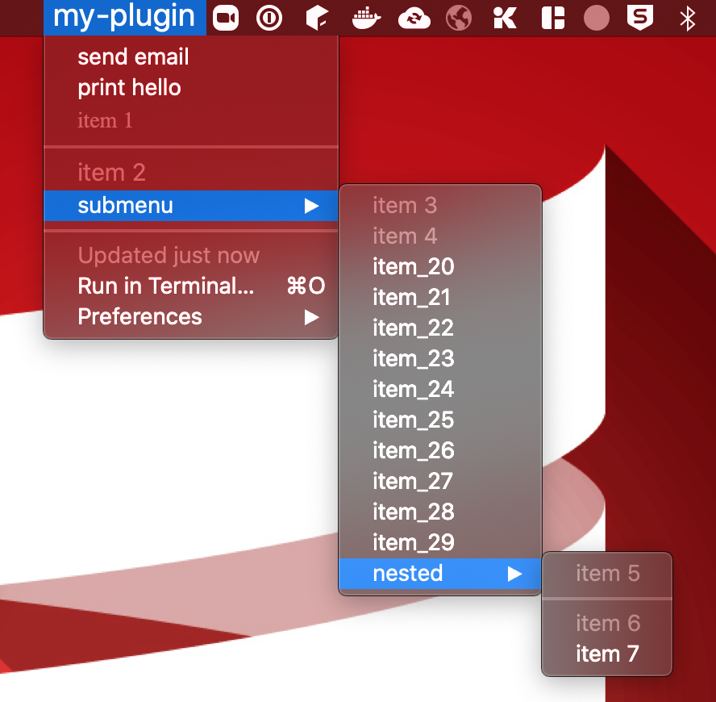

# BitBar4s

> _This was a hobby project built in 2 days during a weekend_

BitBar4s enables scala developers to create plugins for [bitbar](https://github.com/matryer/bitbar) in a declarative and easy way

## Installation

This is not published to maven yet

## Usage

- create an `object` and extend from `BitBarApp with BitBarDsl`

- override `pluginName`

```scala
override val pluginName: String = "myplugin"
```

- create a handler for actions your plugin may dispatch. Example:

```scala
override val handler: Handler = {
  case ("send-email", Some(email)) => 
    sendEmail(email)
  
  case ("push", Some(id)) => 
    httpPost(id)
  
  case ("trigger-something", Some(something)) => 
    interactWithMobileDevice(something)
}
```

- Use the dsl to create menu items either statically for dynamically. Example:

```scala
  override val appMenu = menu("my-plugin", color = if(isDarkMode) "white" else "red", textSize = 20) {
    action("send email", "send-email", Some("abc@xyz.com"), true)
    action("print hello", "print-hello", showTerminal = true)
    text("item 1", font = "Times")
    ---
    text("item 2", textSize = 15)
    subMenu("submenu"){
      text("item 3")
      text("item 4")
      Range(20,30).foreach{ i =>
        link(s"item_$i", "http://google.com")
      }
      subMenu("nested", color = "orange"){
        text("item 5")
        ---
        text("item 6")
        shellCommand("item 7", "echo", showTerminal = true ,params = "hello world", "sds")
      }
    }
  }
```



You can create, static texts, web links, shell command triggers, and most importantly, actions.

All the items support configuratios such as color, text size, image, refresh, etc. 
